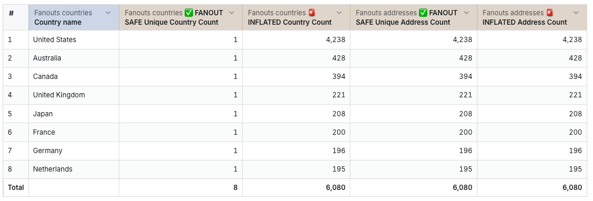
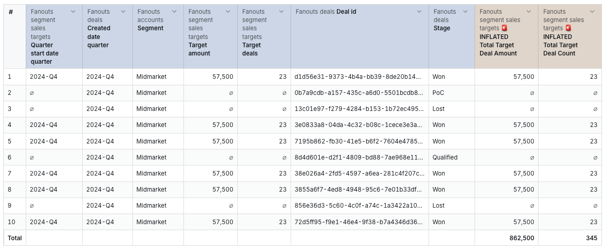
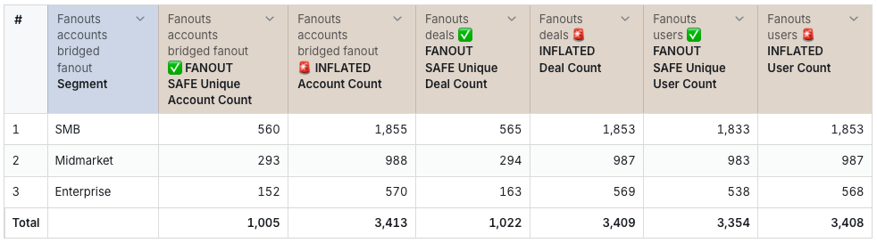

# Fanout Examples Models

## Table of Contents
1. [Overview](#overview)
2. [Entity Relationship Diagram](#entity-relationship-diagram)
3. [Single 1-to-Many Joins](#1-single-1-to-many-joins)
   - [Example 1: Accounts → Deals](#example-1-accounts--deals)
   - [Example 2: Accounts → Users](#example-2-accounts--users)
4. [Chained 1-to-Many Joins](#2-chained-1-to-many-joins)
   - [Example 3: Accounts → Users → Tracks](#example-3-accounts--users--tracks)
5. [Parallel 1-to-Many Joins](#3-parallel-1-to-many-joins)
   - [Example 4: Accounts → Deals + Users](#example-4-accounts--deals--users-parallel-joins)
6. [One-to-One Joins](#5-one-to-one-joins)
   - [Example 5: Users → Addresses](#example-5-users--addresses-11-join)
7. [Many-to-One Joins](#6-many-to-one-joins)
   - [Example 6: Addresses → Countries](#example-6-addresses--countries-many1-join)
8. [Many-to-One Joins with Complex Conditions](#7-many-to-one-joins-with-complex-conditions)
   - [Example 7: Deals → Sales Targets](#example-7-deals--sales-targets-complex-conditional-join)
9. [Bridged Many-to-Many Joins](#8-bridged-many-to-many-joins)
   - [Example 8: Accounts → Deals → User_Deals → Users](#example-8-accounts--deals--user_deals--users-bridged-many-to-many)
10. [Key Takeaways](#key-takeaways)
11. [Summary Comparison Table](#summary-comparison-table)

## Overview

Here are examples of the different joins which can cause SQL fanouts also known as metric inflation.
I have created copies of the models we use in the SaaS demo in the `fanouts_examples` folder and with the prefix `fanouts_`. These models include:

- fanouts_accounts
- fanouts_deals
- fanouts_users
- fanouts_tracks
- fanouts_addresses
- fanouts_countries
- fanouts_user_deals (only userd for example 8)


---

### Entity Relationship Diagram

This ERD applies to all examples except example 8 which has a different relationship between accounts, deals and users. 

```
ACCOUNTS (Companies) 
    ↓ account_id
    ├─► DEALS (Sales Pipeline) [1:many]
    │     ↓ (accounts.segment/industry + deals.created_at quarter)
    │     └─► SALES_TARGETS (Quarterly Goals) [many:1]
    └─► USERS (Individual Contacts) [1:many]
            ↓ user_id + valid_to is NULL
            ├─► ADDRESSES (User Addresses) [1:1]
            │     ↓ country_iso_code
            │     └─► COUNTRIES (Country Reference) [many:1]
            └─► TRACKS (Product Usage) [1:many]
```
The SQL joins have been defined in the `fanouts_accounts.yml` file and enable the use of the different dimensions and metrics from each of these models in Lightdash. 

The next section details examples of SQL fanouts. I have defined metrics for each model as follows:

**Metrics safe from fanouts** (prefixed with FANOUT SAFE):

- **unique counts**: will always return a count of unique values which is FANOUT SAFE
- **min/max**: will always return the minimum or maximum values no matter the number of times the rows are inflated 

**Metrics affected by fanouts** (prefixed with INFLATED):

- **counts**: these metrics are only inflated if the data is not at the grain of source table e.g. the count(user_id) metric will be inflated if the users table is joined to another table with a different grain
- **average**: the average is affected because not all rows are inflated equally
- **sum**: adding values that are inflated will result in the incorrect sum
- **median**: calculating the median on inflated result will give the incorrect median value 

## 1. Single 1-to-Many Joins

**Description:** These models demonstrate single 1-to-many relationships where `accounts` is joined to another table with a one-to-many relationship.

**Relationship:** 1 account to many related records.

**Data Grain:** There is a row per related record meaning that metrics for the related table are correct while account metrics that do not apply deduplication techniques will be inflated.

### Example 1: Accounts → Deals

**Selected columns:**
- `fanouts_accounts.segment`
- `fanouts_accounts.unique_account_count`
- `fanouts_accounts.inflated_account_count`
- `fanout_deals.unique_deal_count`
- `fanout_deals.inflated_deal_count`

**Key insights:**
- Metric inflation only happens when you select metrics from both joined tables
- The `inflated_account_count` (567 for SMB) shows how account records get duplicated across their associated deals
- The `inflated_account_count` nearly matches the `unique_deal_count` (565 for SMB), with the small difference indicating some accounts have no deals
- When using left joins, accounts without deals still appear in the result set but don't contribute to deal count metrics


---

### Example 2: Accounts → Users

**Selected columns:**
- `fanouts_accounts.segment`
- `fanouts_accounts.unique_account_count`
- `fanouts_accounts.inflated_account_count`
- `fanout_users.unique_user_count`
- `fanout_users.inflated_user_count`

**Key insights:**
- For SMB accounts: 560 unique accounts become 3,355 rows after joining to users
- The `inflated_account_count` (3,355) shows how many times account records appear when duplicated across all their associated users
- The `inflated_user_count` (3,354) is almost identical to the `inflated_account_count` (3,355)
- The slight difference is because one account has no users - that account still appears in the result set due to the left join (contributing to the inflated account count), but since there's no associated user, it doesn't contribute to the user count metrics
- This demonstrates the classic fanout pattern: accounts get duplicated once for each user they have


---

## 2. Chained 1-to-Many Joins

**Description:** This model demonstrates chained 1-to-many relationships where `accounts` → `users` → `tracks` are joined together, where one account can have many users, and each user can have many tracks.

**Relationship:** 1 account to many users to many tracks (events)

**Data Grain:** There is a row per track/event meaning that track metrics are correct while account and user metrics that do not apply deduplication techniques will be inflated.

### Example 3: Accounts → Users → Tracks

**Selected columns:**
- `fanouts_accounts.segment`
- `fanouts_accounts.unique_account_count`
- `fanouts_accounts.inflated_account_count`
- `fanout_users.unique_user_count`
- `fanout_users.inflated_user_count`
- `fanout_tracks.unique_event_count`
- `fanout_tracks.inflated_event_count`

**Key insights:**
- The data is at the tracks grain, so all metrics marked as "inflated" reflect the number of rows in the tracks table
- For SMB: 560 unique accounts become 55,917 inflated rows - each account appears once for every track event across all its users
- 3,354 unique users become 55,916 inflated rows - each user appears once for every track event they have
- The `unique_event_count` equals the `inflated_event_count` (55,916) because we're already at the tracks grain
- Small differences in totals (like 55,917 vs 55,916) indicate accounts or users with no related records due to left joins
- This shows extreme fanout: a single account can appear tens of thousands of times when chained through multiple 1-to-many relationships


---

## 3. Parallel 1-to-Many Joins

**Description:** This model demonstrates joining `accounts` to both `deals` and `users` simultaneously using separate LEFT OUTER JOINs, creating parallel 1-to-many relationships from the same base table.

**Relationship:** 1 account to many deals AND 1 account to many users (parallel joins)

**Data Grain:** The grain is at the level of account-deal-user combinations, where each account appears once for every unique combination of its deals and users.

### Example 4: Accounts → Deals + Users (Parallel Joins)

**Selected columns:**
- `fanouts_accounts.segment`
- `fanouts_accounts.account_id`
- `fanouts_accounts.unique_account_count` 
- `fanouts_accounts.inflated_account_count`
- `fanouts_deals.unique_deal_count`
- `fanouts_deals.inflated_deal_count`
- `fanouts_users.unique_user_count`
- `fanouts_users.inflated_user_count`

**Key insights:**
- The inflated counts show account-level multiplication: for each account, rows = (deals for that account) × (users for that account)
- Example: Account with 4 deals and 6 users creates 24 rows (4×6)
- Most accounts have 1 deal and 6 users, creating 6 rows each
- The final totals are the sum of individual account-level multiplications: Σ(deals_per_account × users_per_account)
- This is NOT a simple "total deals × total users" calculation
- Each deal for an account gets paired with every user for that same account, creating a Cartesian product within account boundaries

**What happens when accounts have no users or deals:**
- **Account with 3 deals, 0 users:** Creates 3 rows (one per deal, user columns are NULL)
- **Account with 0 deals, 4 users:** Creates 4 rows (one per user, deal columns are NULL)  
- **Account with 0 deals, 0 users:** Creates 1 row (all deal and user columns are NULL)
- The account contributes to `inflated_account_count` in all cases (because the account record exists)
- It only contributes to `inflated_user_count` or `inflated_deal_count` when those relationships actually exist (NULLs aren't counted)
- Multiplication only happens when both deals AND users exist for an account


---

## 5. One-to-One Joins

**Description:** This model demonstrates a one-to-one relationship where `users` is joined to `addresses` with a 1:1 relationship. Each user has exactly one address.

**Relationship:** 1 user to 1 address

**Data Grain:** The grain remains at the user level since it's a 1:1 join, so metrics from both tables should remain accurate without inflation.

### Example 5: Users → Addresses (1:1 Join)

**Selected columns:**
- `fanouts_users.unique_user_count`
- `fanouts_users.inflated_user_count`
- `fanouts_addresses.country`

**Key insights:**
- In a true 1:1 join, there should be **no fanout** - each user appears exactly once
- The `unique_user_count` should equal the `inflated_user_count` since no duplication occurs
- Users without addresses will still appear (due to LEFT JOIN) but with NULL address fields
- This is the safest type of join for metric accuracy since it preserves the original grain
- Address-based grouping (by city, state, country) maintains accurate user counts


---

## 6. Many-to-One Joins

**Description:** This model demonstrates a many-to-one relationship where `addresses` is joined to `countries` with a many:1 relationship. Many addresses can belong to the same country.

**Relationship:** Many addresses to 1 country

**Data Grain:** The grain remains at the address level since we're starting from addresses, so address metrics remain accurate. Country metrics will be duplicated across all addresses in that country.

### Example 6: Addresses → Countries (Many:1 Join)

**Selected columns:**
- `fanouts_addresses.unique_address_count`
- `fanouts_addresses.inflated_address_count`
- `fanouts_countries.country_name`
- `fanouts_countries.unique_country_count`
- `fanouts_countries.inflated_country_count`

**Key insights:**
- **No fanout occurs** for the "many" side (addresses) - each address appears exactly once
- **Fanout occurs** for the "one" side (countries) - each country appears once for every address in that country
- The `unique_address_count` equals `inflated_address_count` since addresses aren't duplicated
- The `inflated_country_count` shows how many addresses exist in each country (country records are duplicated)
- For example: If USA has 1,000 addresses, the country "USA" will appear 1,000 times in the result set
- This is the **reverse** of the typical fanout pattern - here the "one" side gets inflated, not the "many" side
- Country-level metrics (like `inflated_country_count`) will be incorrect, while address-level metrics remain accurate



---

## 7. Many-to-One Joins with Complex Conditions

**Description:** This model demonstrates many-to-one relationships with complex matching conditions beyond simple foreign key relationships. Multiple records can match to the same target record based on date ranges, categorical values, and status conditions, causing the target data to be replicated.

**Relationship:** Many source records to 1 target record (filtered by multiple conditions)

**Data Grain:** The grain remains at the source record level, but target metrics become inflated as the same target appears multiple times across matching source records.

### Example 7: Deals → Sales Targets (Complex Conditional Join)

**Join Configuration:**
```yaml
- join: fanouts_sales_targets
  alias: fanouts_segment_sales_targets
  relationship: many_to_one # Many deals to one target
  sql_on: |
    ${fanouts_deals.created_date} BETWEEN ${fanouts_segment_sales_targets.quarter_start_date} AND ${fanouts_segment_sales_targets.quarter_end_date} 
    AND (${fanouts_deals.stage} = 'Won' AND ${fanouts_accounts.segment} = ${fanouts_segment_sales_targets.target_value} AND ${fanouts_segment_sales_targets.target_type} = 'segment')
  type: left # Since this is a LEFT JOIN, deals that are not 'Won' will appear with NULL sales target data
```

**Fanout Effect:**
- Multiple source records matching complex conditions join to one target record
- Accounts is joined onto Deals for additional info but does not affect the fanout because there is a one-to-many relationship between Accounts and Deals. 
- The target data gets replicated for each matching source record
- Non-matching records appear with NULL target data (due to LEFT JOIN)
- SUM metrics on target values become inflated

**Example Visual:**
```
Source Records:            Target Record:           Result After Join:
Deal A (Won, SMB, Q1) ─┐                            Deal A + SMB Q1 Target
Deal B (Won, SMB, Q1) ─┼─► SMB Q1 Target: $100K ─►  Deal B + SMB Q1 Target  
Deal C (Lost, SMB, Q1)─┘                            Deal C + NULL
                                                   
Total Target Sum: $200K (inflated from $100K actual target)
```

**Key insights:**
- **Complex conditions** create selective fanout - only records meeting multiple criteria join to targets
- **Same target, multiple sources** - one target record gets duplicated across all matching source records
- **LEFT JOIN behavior** - source records that don't match conditions still appear with NULL target values
- **Metric inflation** - `SUM(target_value)` becomes inflated because the same target value is counted multiple times
- **Safe metrics** - `COUNT_DISTINCT` on target fields would remain accurate despite the duplication

**Common Use Cases:**
- Time-based matching (quarters, fiscal years, date ranges)
- Category-based matching (segments, regions, product types)
- Status-based filtering (active records, completed transactions)
- Multi-dimensional lookups (geography + time + category)

This screenshot shows how the target deal count and target deal value will be inflated by the number of deals joined to the target. 


---

## 8. Bridged Many-to-Many Joins

**Description:** This model (`fanouts_accounts_bridged_fanout`) demonstrates a many-to-many relationship between deals and users through a junction table, creating extreme multiplicative fanout effects. The join chain flows: Accounts → Deals → User_Deals (junction table) → Users. Note this is different to how we joined users to accounts before using accounts.user_id and users.user_id. 

**Relationship:** 1 account to many deals, then many deals to many users (implemented via junction table)

**Data Grain:** The grain becomes account-deal-user combinations, where each account appears once for every unique deal-user pairing associated with that account.

### Entity Relationship Diagram for Bridged Join:
```
ACCOUNTS
    ↓ account_id (1:many)
DEALS  
    ↓ deal_id (1:many)
USER_DEALS (Junction Table)
    ├─ user_id + deal_id (Primary Key)
    ├─ role
    ↓ user_id (many:1)
USERS

Overall: DEALS ↔ USERS (many:many via USER_DEALS junction table)
```

### Example 8: Accounts → Deals → User_Deals → Users (Bridged Many-to-Many)

**Join Configuration (detailed in fanouts_accounts_bridged_fanout.yml):**
```yaml
# Simple 1-to-many: Accounts → Deals
- join: fanouts_deals
  relationship: one_to_many
  sql_on: ${fanouts_accounts_bridged_fanout.account_id} = ${fanouts_deals.account_id}

# Many-to-many bridge: Deals → User_Deals (junction table)  
- join: fanouts_user_deals
  relationship: one_to_many
  sql_on: ${fanouts_deals.deal_id} = ${fanouts_user_deals.deal_id}

# Many-to-many completion: User_Deals → Users
- join: fanouts_users
  relationship: many_to_one
  sql_on: ${fanouts_user_deals.user_id} = ${fanouts_users.user_id}
```

**Junction Table Structure:**
- **Primary Key:** (user_id, deal_id) - ensures each user can only have one role per deal
- **Enables Many-to-Many:** Multiple deals can have multiple users, multiple users can work on multiple deals
- **Role Field:** Captures the user's role on each deal (primary_contact, stakeholder, etc.)

**Fanout Effect:**
- Creates extreme multiplicative fanout through the deals-to-users many-to-many relationship
- Each account record gets multiplied by the total number of user-deal combinations for that account
- If an account has 2 deals where one deal has 3 users and another has 4 users, that account appears 7 times in the result set (3+4)
- The junction table enables the many-to-many relationship between deals and users

**Key insights:**
- **Many-to-many implementation** - the junction table USER_DEALS implements the many-to-many relationship between DEALS and USERS
- **Chained through accounts** - accounts connect to this many-to-many relationship via their deals
- **Extreme multiplication** - account records can be duplicated hundreds or thousands of times
- **Additive per deal** - each deal contributes rows equal to its user count, summed across all deals for an account
- **COUNT vs COUNT_DISTINCT** - regular COUNT metrics become severely inflated while COUNT_DISTINCT remains safe

This pattern demonstrates how many-to-many relationships through junction tables create much more severe fanout than simple 1-to-many joins, requiring careful attention to metric design and understanding of data grain.



---

## Key Takeaways

- **Fanout occurs** when joining tables with 1-to-many relationships, causing "parent" records to be duplicated
- **Chained joins amplify fanout** - each additional 1-to-many relationship multiplies the inflation effect
- **Parallel joins create Cartesian products** at the account level - every combination of related records within each account
- **Left joins preserve** all records from the left table, even when there are no matching records on the right
- **Count metrics** only reflect actual relationships - NULL values from unmatched left join records don't get counted
- **Data grain matters** - understanding which table determines your final row count is crucial for interpreting metrics correctly
- **Complex conditional joins** can create selective fanout where only records meeting multiple criteria contribute to duplication

## Summary Comparison Table

| Join Type | Relationship | Fanout Effect | Data Grain | Safe Metrics | Inflated Metrics | Example |
|-----------|-------------|---------------|------------|--------------|------------------|----------|
| Single 1:Many | 1 account → many deals | Moderate | Child table | COUNT_DISTINCT | COUNT, SUM | Accounts → Deals |
| Chained 1:Many | 1 account → many users → many tracks | Extreme | Final child table | COUNT_DISTINCT | COUNT, SUM, AVG | Accounts → Users → Tracks |
| Parallel 1:Many | 1 account → many deals AND many users | Cartesian product | Account combinations | COUNT_DISTINCT | COUNT, SUM, AVG | Accounts → (Deals + Users) |
| One-to-One | 1 user → 1 address | None | Original table | All metrics | None | Users → Addresses |
| Many-to-One | Many addresses → 1 country | Reverse fanout | Source table | Source metrics | Target metrics | Addresses → Countries |
| Complex Many:1 | Many deals → 1 target (filtered) | Selective | Source table | COUNT_DISTINCT | SUM of targets | Deals → Sales Targets |
| Bridged Many:Many | Accounts → Deals ↔ Users (via junction) | Extreme multiplicative | Junction combinations | COUNT_DISTINCT | COUNT, SUM, AVG | Accounts → Deals → User_Deals → Users |