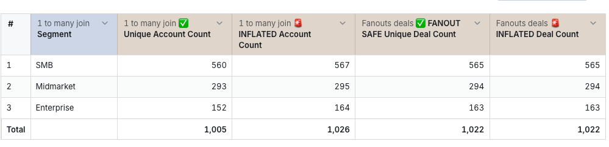
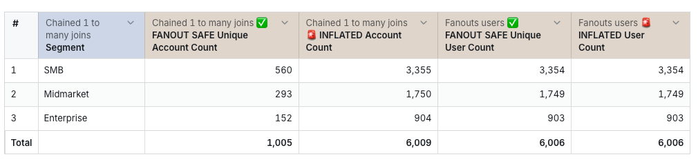
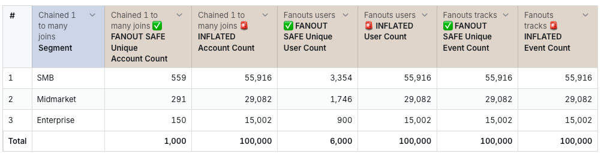

# Fanout Examples Models
This set of dbt models were created to allow for development and testing of the many-to-many joins feature where we want to first warn users when a join might cause metric inflation as a result of records being multiplied when models or tables are joined together. 

For the purposes of testing I have created the following sets of models which actually refer tot he base table `accounts`. These are: 

## 1. 1_to_many_join 
- Description: This `accounts` model is joined to `deals` (renamed `fanout_deals`) where one account can have many deals.  
- Relationship: 1 account to many deals 
- Data Grain: There is a row per deal_id meaning that in this model deal metrcis are correct while account metrics that do not apply deduplication techniques will be inflated. 

- Example 1:
Select `1_to_many_join.segment`, `1_to_many_join.unique_account_count`, `1_to_many_join.inflated_account_count`, `fanout_deals.unique_deal_count`, `inflated_deal_count`. 
Notes: 
- Note that metric inflation only happens when you select metrics from both tables. 
- The `inflated_account_count` will be the same as the `unique_deal_count` unless an account has no deal (see first row `Technology`)
- count unique, max and min metrics are not affected by metric inflation. 

- Example 2: 
Select the columns are:
chained_1_to_many_joins.segment
chained_1_to_many_joins.unique_account_count
chained_1_to_many_joins.inflated_account_count
fanout_users.unique_user_count
fanout_users.inflated_user_count

The pattern you're seeing:
For SMB accounts: 560 unique accounts become 3,355 rows after joining to users. The inflated account count (3,355) shows how many times account records appear when duplicated across all their associated users.
The inflated user count (3,354) is almost identical to the inflated account count (3,355). The slight difference is because one account has no users - that account still appears in the result set due to the left join (contributing to the inflated account count), but since there's no associated user, it doesn't contribute to the user count metrics.
This shows the classic fanout pattern: accounts get duplicated once for each user they have, while the user counts reflect the actual user records that exist in those relationships.

## 2. 1_to_many_join example
- Description: This `accounts` model is joined to `users` (renamed `fanout_users`) and "tracks" (renamed `fanout_tracks`). An account can have one or more users and each user can have one or more tracks. 
- Relationship: 1 account to many users, 1 user many tracks 
- Data Grain: There is a row per track_id meaning that in this model tracks metrics are correct while account or user metrcis that do not apply deduplication techniques will be inflated. 

Example 2:
Select `chained_1_to_many_joins.segment`, `chained_1_to_many_joins.unique_account_count`, `chained_1_to_many_joins.inflated_account_count`, `fanout_users.unique_user_count`, `fanout_users.inflated_user_count`. 

Notes: 
- Note that metric inflation only happens when you select metrics from the other tables tables. 
- We have only selected data from `chained_1_to_many_joins` (accounts) and `fanout_users`, therefore the data is at the user grain. This means that: 
- `unique_account_count` < `inflated_account_count` 
- `inflated_account_count` is similar to the `unique_user_count` because it we get a record per user associated with each account. It is not exactly the same because not all accounts have users. 
- `unique_user_count` = `inflated_user_count` the results dataset has a row per user so these values are equal. 

Example 3: 
Select `chained_1_to_many_joins.segment`, `chained_1_to_many_joins.unique_account_count`, `chained_1_to_many_joins.inflated_account_count`, `fanout_users.unique_user_count`, `fanout_users.inflated_user_count`, `fanout_tracks.unique_event_count`, `fanout_tracks.inflated_event_count`

Notes:   
- Below, we have selected data from `chained_1_to_many_joins` (accounts), `fanout_users` and `fanout_tracks`, therefore the data is at the tracks grain. This means that all metrics marked with "inflated" reflect the number of rows in the tracks table, plus if the joins are left joins then there will also be records for accounts without users and users without tracks.   
- `unique_account_count` < `inflated_account_count` and `unique_user_count` < `inflated_user_count` because the inflated metrics refer to the number of rows generated from the join not unqiue values in each of these fields. 
- `inflated_account_count` is similar to the `unique_event_count` (inflated account count inflates to number of tracks rows)
- `inflated_user_count` = `unique_event_count` (inflated user count inflates to number of tracks rows)
`unique_account_count` < `inflated_account_count` because the account records are inflated to the number of users per account. 
- `unique_user_count` < `inflated_user_count` because the user records are inflated to the number of tracks per user. 
- `unique_event_count` =  `inflated_event_count` because the data is at the grain of tracks. 

